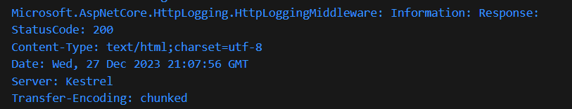
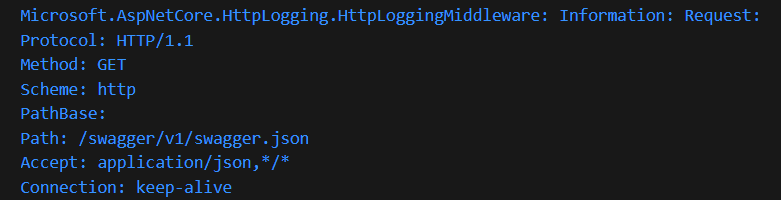
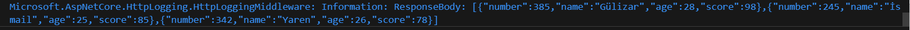

# StudentApp-Homework-W2
--İlk hafta geliştirdiğiniz api kullanılacaktır.
--Rest standartlarına uygun olmalıdır.
--Solid prensiplerine uyulmalıdır.

--Fake servisler geliştirilerek Dependency injection kullanılmalıdır.
FakeUserLogin yaparak hem Dependency injection maddesi hem de Bonus maddesi yapıldı.

--Ap’ nizde kullanılmak üzere extension geliştirin.
namespace WebApi.Extensions
{
    public static class StringExtensions { }
}
--Swagger : \Program.cs

--Global loglama yapan bir middleware(sadece actiona girildi gibi çok basit düzeyde)

terminalde response body de gelen isteğin döndüğü datayı bir günlüğüne görebiliyoruz.

------Bonus----
FakeUserLogin yaparak hem Dependency injection maddesi hem de Bonus maddesi yapıldı.

 
